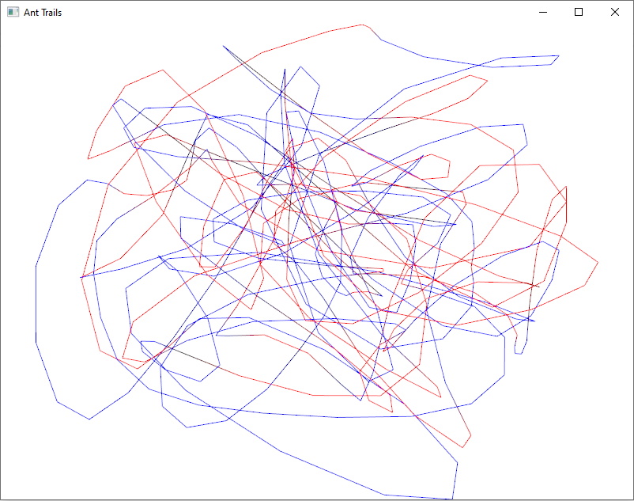
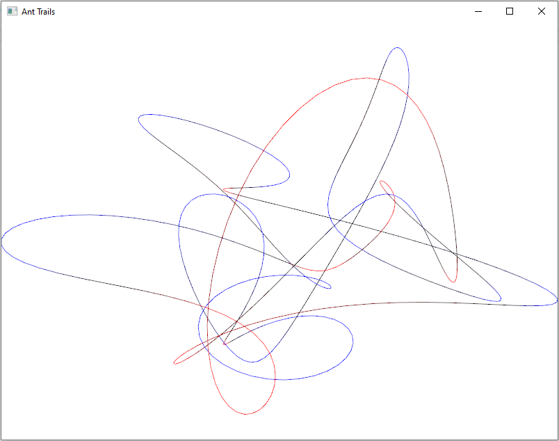
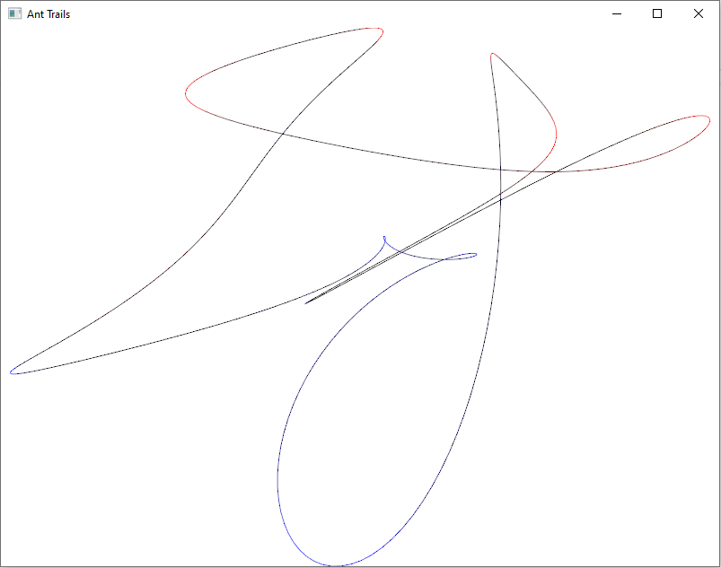
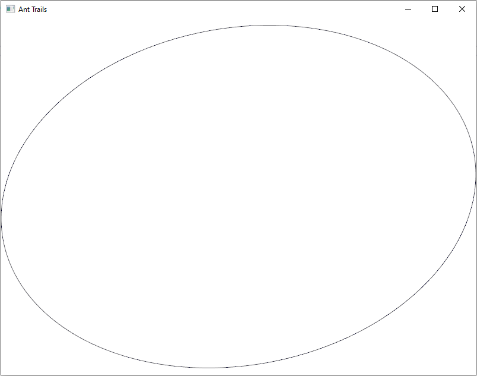

# The Ant Trails Problem

Consider the following problem: given a polygon whose vertices are denoted as

$$V = \{(x_i, y_i) \}_{i = 0}^N \,,$$

let the sequence of polygons $V^{(j)}$ be given by $V^{(0)} = V$ and letting the vertices of $V^{(j)}$ be the midpoints of the vertices of $V^{(j - 1)}$, i.e.,

$$V^{(j)} = \{(x_i^{(j)}, y_i^{(j)})\}_{i = 0}^N \,,$$
$$x_i^{(j)} = (x_{i+1}^{(j - 1)} + x_i^{(j - 1)}) / 2\,,$$
$$y_i^{(j)} = (y_{i+1}^{(j - 1)} + y_i^{(j - 1)}) / 2\,.$$

What will be the shape of $V^{(j)}$ as $j \rightarrow \infty$?

## The Answer

I won't tell you why, because it's your job to find out, but the answer is that $V^{(j)}$ will eventually converge to an **ellipse** if it is property rescaled every time. To show that process by which this happens, I wrote a little graphics program to animate the $V^{(j)}$'s out on screen starting from a random initialization. Here's a trail run:

